# Object Oriented Horse Race
Get ready... To LOSE... AGAIN!!!



## Classes

### **main.cpp**
```
make variable race of type Race
call Race.run()
```

### **horse.h**
```
class Horse:

+Horse()
+void init(int inId, int inTrackLength)
+void advance()
+void printLane()
+bool isWinner()

-int position
-int trackLength
-int id
```

### **horse.cpp**

**Horse()**
```
function Horse():
    set position to 0
    set trackLength to 0
    set id to -1
```

**init**
```
function init(int inId, int inTrackLength):
    set id to inId
    set trackLength to inTrackLength
```

**advance**
```
function advance():
    make int random with randomfloat(0.0, 2.0)
    round random to int    
    add random to position
```

**printLane**
```
function printLane():
    for 0 to TRACK_LENGTH:
        if loop index is equal to position:
            print id
            continue
        print "."
```

**isWinner**
```
function isWinner():
    return position is greater than or equal to trackLength + 1
```

### **race.h**
```
class Race:

+Race()
+void run()

-int TRACK_LENGTH
-int MAX_HORSES
-Horse horses[Max_HORSES]
```

### **race.cpp**

**Race()**
```
function Race():
    for 0 to MAX_HORSES:
        Horse horse = horses[loop index]
        call horse.init(loop index, TRACK_LENGTH)
        call horse.printLane() 
```

**run**
```
function run():
    set keepGoing to true
    while keepGoing:
        ask user for input to continue
        for each horse in horses:
            call horse.advance()
            call horse.printLane()
            if call horse.isWinner():
                set keepGoing to false
    for each horse in horses:
        if call horse.isWinner():
            print "Horse " + loop index + " Won!"
            ask user for input to end
```
